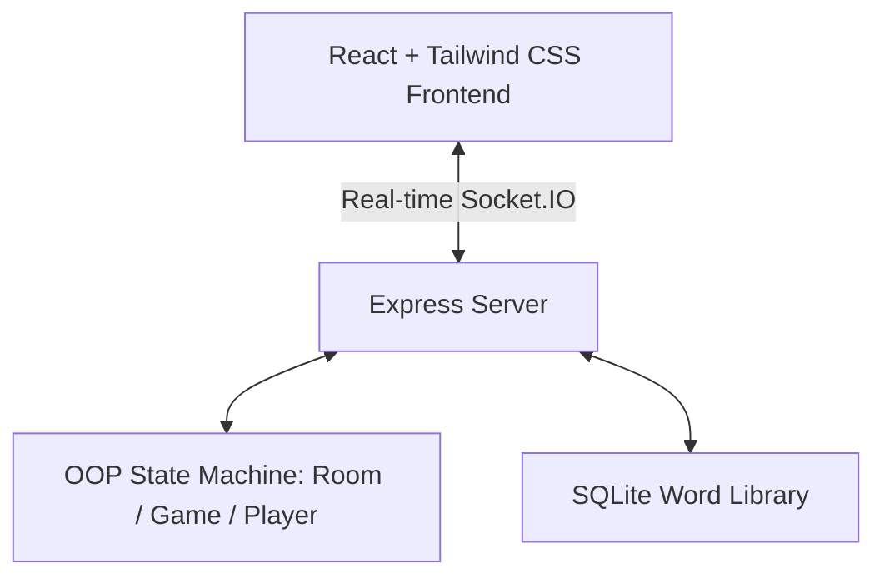

# Skribbl.io Clone - Real-time Multiplayer Drawing & Guessing Game

An end-to-end multiplayer pictionary clone built with React, Node.js (Express), WebSockets (Socket.IO), and SQLite.

## Live Deployment
- **Live URL**: [https://your-skribbl-clone.onrender.com](https://your-skribbl-clone.onrender.com) (Example: Deploy backend to Render, frontend to Vercel/Netlify)

---

## Architecture Overview



### 1. Real-time Drawing Sync Engine
- **Logical Canvas Coordinates**: To prevent drawings from skewing or stretching on different screen sizes (mobile vs. high-DPI monitors), the HTML5 Canvas uses a fixed logical resolution of **800x600**.
- **Transformation Matrix**: When a player draws, their physical coordinates are scaled to the logical size:
  $$x_{logical} = \frac{x_{client} - rect.left}{rect.width} \times 800$$
  $$y_{logical} = \frac{y_{client} - rect.top}{rect.height} \times 600$$
- **Segment Transmission**: Drawing data is streamed stroke-by-stroke over Socket.IO (using `draw_start`, `draw_move`, and `draw_end` channels) and stored in-memory in the game session.
- **State Restoration**: When a player joins a game mid-round, the server automatically synchronizes the current round's drawing history (`drawingStrokes`), allowing the client to redraw the active canvas instantly.

### 2. OOP Game State Machine
The backend structures multiplayer states in well-defined JavaScript classes:
- **`Player`**: Encapsulates player credentials, ready status, round/total score, and guessing flags.
- **`Room`**: Manages player groupings, hosts status, invite codes, and custom settings (rounds, limit, category).
- **`Game`**: Controls the active game phases (`lobby` -> `word_selection` -> `drawing` -> `round_end` -> `game_over`), interval timers, hints generation, and scoreboard sorting.

### 3. Word Matching & Close Guess Engine
- **Exact Matches**: User inputs are sanitized (trimmed, case-insensitive) and compared with the target word.
- **Close Guess Detection**: Uses an optimized edit distance algorithm (Levenshtein) to check if a player's guess is within an edit distance of **1**. If close, it notifies the player privately and shares it in the correct guessers' sub-chat to prevent spoilers.
- **Word Bank**: Categorized word libraries (Animals, Food, Objects, Places, Actions) are pre-loaded from an SQLite database.

---

## WebSocket Protocols & Events

| Event Name | Direction | Payload | Description |
|---|---|---|---|
| `create_room` | Client $\rightarrow$ Server | `{ hostName, avatar, settings }` | Creates a new game lobby with settings |
| `join_room` | Client $\rightarrow$ Server | `{ roomId, playerName, avatar }` | Joins a player to an active lobby |
| `player_joined` | Server $\rightarrow$ Clients | `{ player, players }` | Broadcasts new player credentials |
| `player_ready_toggle` | Server $\rightarrow$ Clients | `{ playerId, isReady, players }` | Syncs lobby readiness status |
| `start_game` | Client $\rightarrow$ Server | `None` | Starts turn rotation (Host only) |
| `round_start` | Server $\rightarrow$ Clients | `{ drawerId, wordOptions, ... }` | Initiates word selection phase |
| `word_chosen` | Client $\rightarrow$ Server | `{ word }` | Activates canvas drawing mode |
| `draw_start` / `_move` | Client $\rightarrow$ Server | `{ x, y, color, size }` | Broadcasts brush stroke segment |
| `guess` / `chat_message` | Client $\rightarrow$ Server | `{ text }` | Evaluates guesses and forwards chats |
| `guess_result` | Server $\rightarrow$ Clients | `{ correct, isClose, playerName, ... }` | Returns correct/close feedback |

---

## Local Setup

### Prerequisites
- Node.js (v18+)
- npm

### 1. Run Backend Server
```bash
cd backend
npm install
npm run dev # Runs server.js on port 3000
```

### 2. Run Frontend Client
```bash
cd frontend
npm install
npm run dev # Runs Vite dev server on http://localhost:5173
```

---

## Deployment Instructions

### Deploying to Render (Full-Stack Backend)
1. Sign up on **Render** and click **New Web Service**.
2. Connect your Git repository.
3. Configure settings:
   - **Environment**: Node
   - **Build Command**: `cd backend && npm install`
   - **Start Command**: `cd backend && node server.js`
4. Set environment variable `PORT` to `3000` or let Render automatically bind it.

### Deploying to Vercel (Frontend)
1. Sign up on **Vercel** and import your project.
2. Configure build settings:
   - **Root Directory**: `frontend`
   - **Build Command**: `npm run build`
   - **Output Directory**: `dist`
3. Add Environment Variable:
   - `VITE_BACKEND_URL`: URL of your Render backend (e.g., `https://your-backend.onrender.com`).
