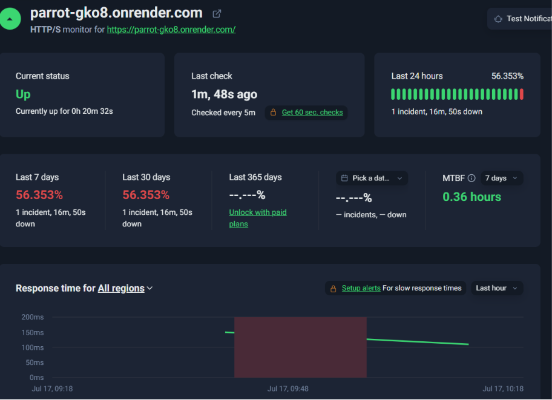
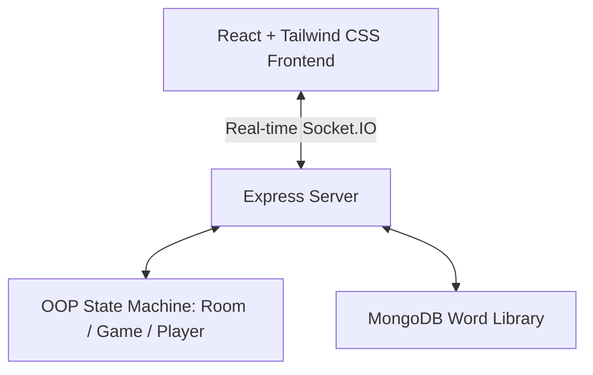
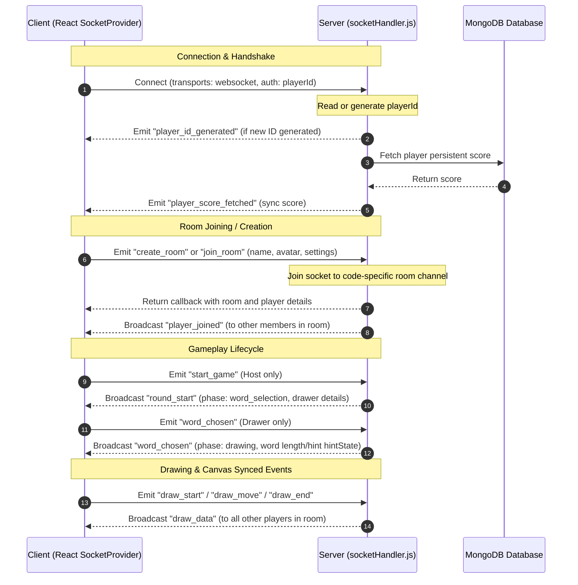

# Skribbl.io Clone - Real-time Multiplayer Drawing & Guessing Game

An end-to-end multiplayer pictionary game built with React, Node.js (Express), WebSockets (Socket.IO), and MongoDb.

## Live Deployment
- **Backend URL**: [https://your-skribbl-clone.onrender.com](https://your-skribbl-clone.onrender.com) 
- **Frontend URL**: [https://parrot-theta-eosin.vercel.app/](https://parrot-theta-eosin.vercel.app/) 
- **Uptime monitering URL**: [https://dashboard.uptimerobot.com/monitors/803529260](https://dashboard.uptimerobot.com/monitors/803529260) 
    (Uptime is used to consistantly walkup server on Render as free teir sleeps after 15 mins of inactivity).
    
The Shared Monitoring Dashboard is for premium users only.


## Architecture Overview



### 1. Real-time Drawing Sync Engine
- **Logical Canvas Coordinates**: To prevent drawings from skewing or stretching on different screen sizes (mobile vs. high-DPI monitors), the HTML5 Canvas uses a fixed logical resolution of **800x600**.
- **Transformation Matrix**: When a player draws, their physical coordinates are scaled to the logical size:
  $$x_{logical} = \frac{x_{client} - rect.left}{rect.width} \times 800$$
  $$y_{logical} = \frac{y_{client} - rect.top}{rect.height} \times 600$$
- **Segment Transmission**: Drawing data is streamed stroke-by-stroke over Socket.IO (using `draw_start`, `draw_move`, and `draw_end` channels) and stored in-memory in the game session.
- **State Restoration**: When a player joins a game mid-round, the server automatically synchronizes the current round's drawing history (`drawingStrokes`), allowing the client to redraw the active canvas instantly.

### 2. OOP Game State Machine
The backend structures multiplayer states in well-defined JavaScript classes:
- **`Player`**: Encapsulates player credentials, ready status, round/total score, and guessing flags.
- **`Room`**: Manages player groupings, hosts status, invite codes, and custom settings (rounds, limit, category).
- **`Game`**: Controls the active game phases (`lobby` -> `word_selection` -> `drawing` -> `round_end` -> `game_over`), interval timers, hints generation, and scoreboard sorting.

### 3. Word Matching & Close Guess Engine
- **Exact Matches**: User inputs are sanitized (trimmed, case-insensitive) and compared with the target word.
- **Close Guess Detection**: Uses an optimized edit distance algorithm (Levenshtein) to check if a player's guess is within an edit distance of **1**. If close, it notifies the player privately and shares it in the correct guessers' sub-chat to prevent spoilers.
- **Word Bank**: Categorized word libraries (Animals, Food, Objects, Places, Actions) are pre-loaded from a MongoDB database.

---

## Socket.io Connections & Event Architecture

This document explains how real-time WebSocket communication is structured using **Socket.io** on both the client (frontend) and server (backend) sides of the application.

### 1. Client Side (Frontend)

The client-side socket implementation is managed centrally via a React Context provider defined in `SocketContext.jsx`.

#### Connection Initialization & Lifecycle
When the React application mounts, the `SocketProvider` initiates a single socket instance using the `useEffect` hook:

1. **Endpoint Resolution:** It checks `import.meta.env.VITE_BACKEND_URL` or defaults to `http://localhost:3000`.
2. **Socket Initialization:** 
   ```javascript
   const socketInstance = io(backendUrl, {
     autoConnect: true,
     transports: ['websocket'],
     auth: {
       playerId: localStorage.getItem('playerId')
     }
   });
   ```
   *Note: Using `transports: ['websocket']` skips the default HTTP polling transport and upgrades directly to a persistent WebSocket connection.*
3. **Authentication:** It passes a persistent `playerId` from `localStorage` in the `auth` handshake to restore existing sessions on reconnection.
4. **Cleanup:** When the provider unmounts, `socketInstance.disconnect()` is called to clean up active resources and prevent memory leaks.

#### State Synchronization
The client maintains internal React states mapping directly to room metadata and gameplay state:
- `isConnected`: Tracking connection status.
- `players`: Array of players currently in the room.
- `roomSettings`: Settings of the room (e.g. rounds, drawing time, privacy).
- `gameState`: An object containing the current phase (`lobby`, `word_selection`, `drawing`, `round_end`, `game_over`), active drawer, selected word, hint, and remaining time.
- `chatMessages`: The room's chat feed (including system/guess messages).

### 2. Server Side (Backend)

The backend server is powered by Express and Node's HTTP module, integrated with the Socket.io `Server` library.

#### Initialization
In `server.js`:
1. An HTTP server is created wrapping the Express app (`http.createServer(app)`).
2. The Socket.io `Server` is instantiated with CORS rules allowing requests from the frontend client.
3. The server hands off the socket instance to `handleSocketConnections(io)` located in `socketHandler.js`.

```javascript
const server = http.createServer(app);
const io = new Server(server, {
  cors: { origin: cors__origin }
});
handleSocketConnections(io);
```

#### Server-Side State Tracking
In `socketHandler.js`, two main in-memory data structures track active players and rooms:
- **`rooms_Map`**: Maps `RoomCode` strings to active room objects (`Room`).
- **`onlinePlayers`**: Maps `playerId` strings to active player metadata (IDs, socket IDs, names, database scores).

#### Connection Lifecycle (Handshake)
When a client connects:
1. **User Identifier:** The server checks `socket.handshake.auth.playerId`. If empty, it generates a new UUID and emits `player_id_generated` back to the client.
2. **Online Registry:** The player is registered in `onlinePlayers` with their active `socket.id`.
3. **Database Hydration:** The server fetches the player's persistent score from the database via `getPlayerScore(playerId)` and emits `player_score_fetched`.

### 3. Client-Server Interaction Flow

The interaction between client and server is entirely event-driven. Below is a breakdown of the key stages and the corresponding events mapped between client and server.



### 4. Detailed Event Reference Table

| Frontend Action / Function | Client-Side Event (Sent/Received) | Server-Side Listener / Handler | Description |
| :--- | :--- | :--- | :--- |
| **Connection & Authentication** | Sent: Connection handshake payload<br>Received: `player_id_generated` | `connection` | Establishes the WebSocket tunnel. Generates and registers player details. |
| **Fetch Scores** | Received: `player_score_fetched` | Database Query helper | Syncs current player score from the database on initial handshake. |
| **Room Creation** | `createRoom(...)` -> Emit: `create_room` | `socket.on('create_room', ...)` | Generates room code, maps room, joins socket room (`socket.join(roomCode)`), and returns code. |
| **Lobby Ready** | `toggleReady()` -> Emit: `toggle_ready` | `socket.on('toggle_ready')` | Toggles the player's lobby readiness. Broadcasts updated status to the room. |
| **Join/Quick Join** | `joinRoom(...)` -> Emit: `join_room` | `socket.on('join_room')` / `quick_join` | Joins a room, handles name duplications, sends callback response. |
| **Drawing Sync** | Canvas handlers -> Emit: `draw_start`, `draw_move`, `draw_end` | `socket.on('draw_start')`, etc. | Server appends stroke metadata and broadcasts `draw_data` to all other room sockets. |
| **Canvas Modification** | `canvas_clear` / `draw_undo` | `socket.on('canvas_clear')` / `draw_undo` | Clears/slices drawing history on server and notifies client canvas instances. |
| **Chat & Guess Verification** | `sendChatMessage(...)` -> Emit: `chat_message` | `socket.on('chat_message')` | Checks guess against the secret word. If correct, awards points and triggers guess result. Otherwise, broadcasts normal chat. |
| **Round Lifecycle** | Received: `round_start` / `word_chosen` / `round_end` / `game_over` | Room logic wrapper | Coordinates countdowns, drawer/word assignments, and score updates. |
| **Session Disconnect** | Cleanup callback (`socketInstance.disconnect()`) | `socket.on('disconnect')` | Removes player from room and `onlinePlayers` cache. Cleans up empty rooms automatically. |

---

## Local Setup

### Prerequisites
- Node.js (v18+)
- npm

### 1. Run Backend Server
```bash
cd backend
npm install
npm run dev # Runs server.js on port 3000
```

### 2. Run Frontend Client
```bash
cd frontend
npm install
npm run dev # Runs Vite dev server on http://localhost:5173
```

---

## Deployment Instructions


### Deploying to Vercel (Frontend)
1. Sign up on **Vercel** and import your project.
2. Configure build settings:
   - **Root Directory**: `frontend`
   - **Build Command**: `npm run build`
   - **Output Directory**: `dist`
3. Add Environment Variable:
   - `VITE_BACKEND_URL`: URL of your Render backend (e.g., `https://your-backend.onrender.com`).


### Deploying to Render (Server)
1. Sign up on **Render** and click **New Web Service**.
2. Connect your Git repository.
3. Configure settings:
   - **Environment**: Node
   - **Build Command**: `cd backend && npm install`
   - **Start Command**: `cd backend && node server.js`
4. Set environment variable `PORT` to `3000` or let Render automatically bind it.
5. Set `CORS_ORIGIN` to `Frontend Url`.
6. Set `MONGODB_URI` .


---
Thank u for reading untill here.
